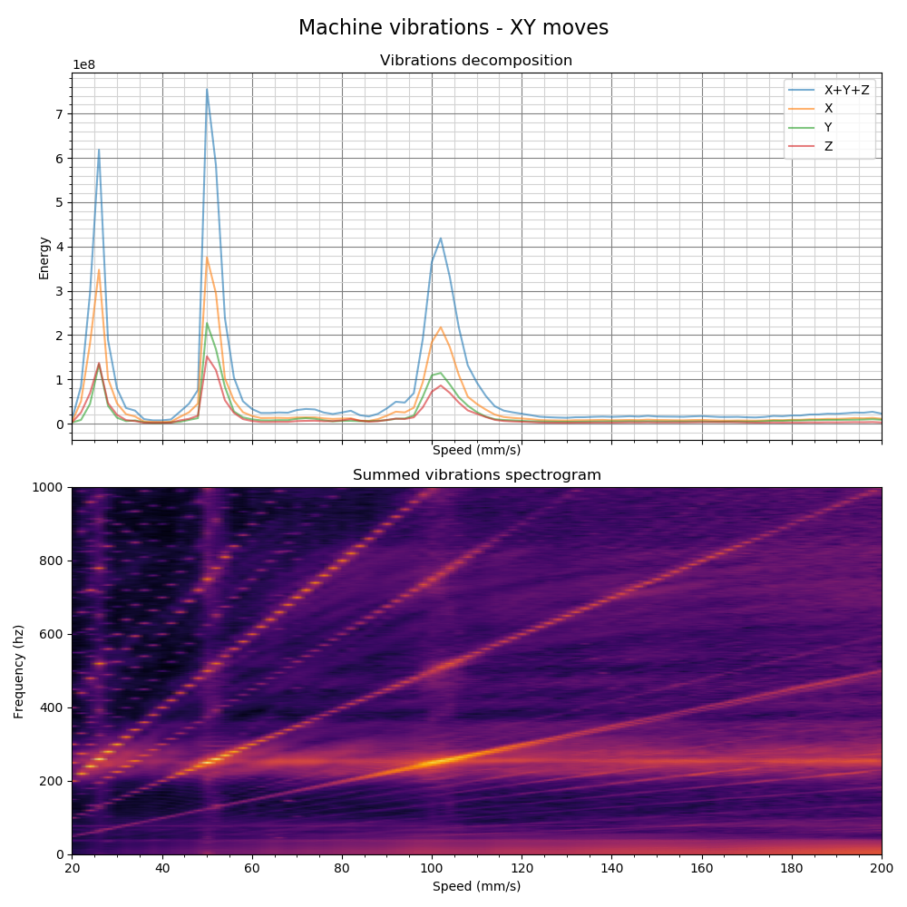

# Vibrations measurements

This macro helps you to identify the speed settings that exacerbate the vibrations of the machine (ie. where the frame resonate badly). It also helps to find the clean speed ranges where the machine is silent.


## Description

I had some strong vibrations at very specific speeds on my machine (52mm/s for example) and I wanted to find all these problematic speeds to avoid them in my slicer profile and finally get the silent machine I was dreaming!

It's a fully automated workflow that work by moving the toolhead while using the accelerometer:
  1. It run a sequence of movements on the axis you want to measure, at different speed settings, while recording the global machine vibrations using the accelerometer.
  2. Then, it call an automatic bash script that automate a few things:
     1. it generate the vibrations graph for the specified axis using the custom made python script.
     2. it then move the graph and associated archive of CSVs to the [ADXL results folder](./../../adxl_results/).
     3. it manage the folder to delete the older files and keep only a set (default is three) of the most recent results.

Results can be found in the [ADXL results folder](./../../adxl_results/) that is placed directly at the root of the config folder to allow the access directly from your browser using the FLuidd/Maisail file manager. No SSH is needed! You can get some hints on the results in my documentation about how to [read and interpret the IS graphs](../input_shaper.md).




## Installation

  1. Copy the [IS_vibrations_measurement.cfg](./../../macros/calibration/IS_vibrations_measurement.cfg) macro file directly into your own config.
  2. Be sure to have the `gcode_shell_command.py` Klipper extension installed. Easiest way to install it is to use the advanced section of KIAUH. This is done automatically when running voronCFG.
  3. Add my [scripts](./../../scripts/) folder at the root of your own config (ie. in your `~/printer_data/config/` directory).

     Note: if using Windows to do the copy/paste of the files, be careful with the line endings for the `plot_graphs.sh` file and the `graph_vibrations.py` file: **Linux line endings (LF or \n) are mandatory!** If the file are using Windows line endings, you will get errors like `\r : unknown command` when running the script. If you're not confident regarding your text editor behavior, the best way is to directly download the files on the pi by using for example wget over SSH:
     
     ```bash
     wget -P ~/printer_data/config/scripts https://raw.githubusercontent.com/mrstone14/voronCFG/main/scripts/plot_graphs.sh
     wget -P ~/printer_data/config/scripts https://raw.githubusercontent.com/mrstone14/voronCFG/main/scripts/graph_vibrations.py
     ```

  4. Make the scripts executable using SSH. When in the folder (`cd ~/printer_data/config/scripts`), use:

     ```bash
     chmod +x ./plot_graphs.sh
     chmod +x ./graph_vibrations.py
     ```

  5. Add this new section at the end of your `printer.cfg` file:
     ```
     [gcode_shell_command plot_graph]
     command: bash /home/pi/printer_data/config/scripts/plot_graphs.sh
     timeout: 500.0
     verbose: True
     ```

     Note: if your user is not `pi`, please correct the path in the command accordingly.

  6. (Optional) You can modify the first lines of the `plot_graphs.sh` script to configure where you want to store the results. Default: `~/printer_data/config/adxl_results`


## Usage

First you need to do the standard input shaper calibration! This macro should not be used before as it would be useless and the results invalid.

Then, call the `VIBRATIONS_CALIBRATION` macro with the direction and speed range you want to measure. Here are the parameters available:

| parameters | default value | description |
|-----------:|---------------|-------------|
|SIZE|60|size in mm of the area where the movements are done|
|DIRECTION|"XY"|direction vector where you want to do the measurements. Can be set to either "XY", "AB", "ABXY", "A", "B", "X", "Y", "Z"|
|Z_HEIGHT|20|z height to put the toolhead before starting the movements. Be careful, if your ADXL is under the nozzle, increase it to avoid a crash of the ADXL on the bed of the machine|
|VERBOSE|1|Wether to log the current speed in the console|
|MIN_SPEED|20|minimum speed of the toolhead in mm/s for the movements|
|MAX_SPEED|200|maximum speed of the toolhead in mm/s for the movements|
|SPEED_INCREMENT|2|speed increments of the toolhead in mm/s between every movements|
|TRAVEL_SPEED|200|speed in mm/s used for all the travels moves|
|ACCEL_CHIP|"adxl345"|accelerometer chip name in the config|

Wait for the script to finish the computation and look for the results in the results folder. You can find them directly in your config folder by using the WebUI of Mainsail/Fluidd. You can get some hints on the results in my documentation about how to [read and interpret the IS graphs](../input_shaper.md).
